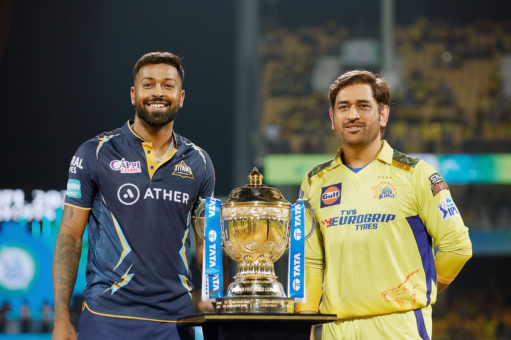
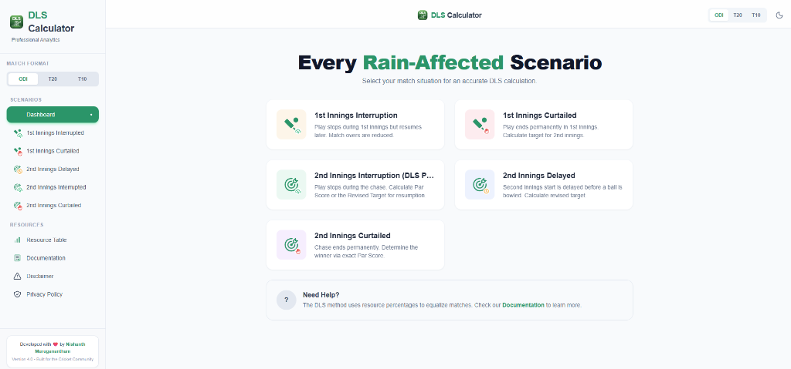
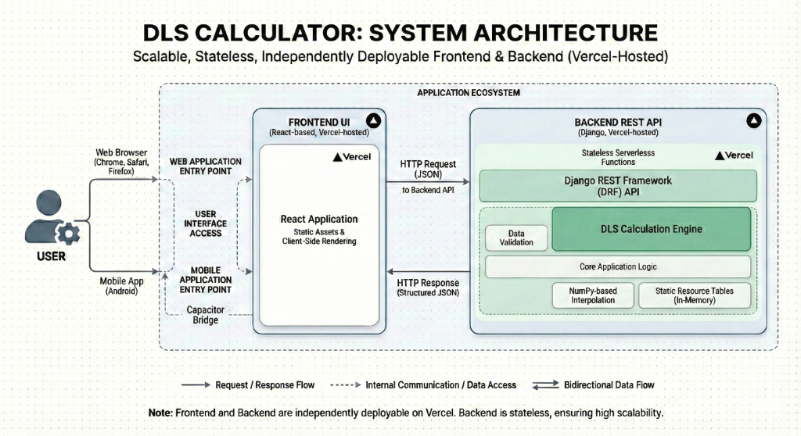
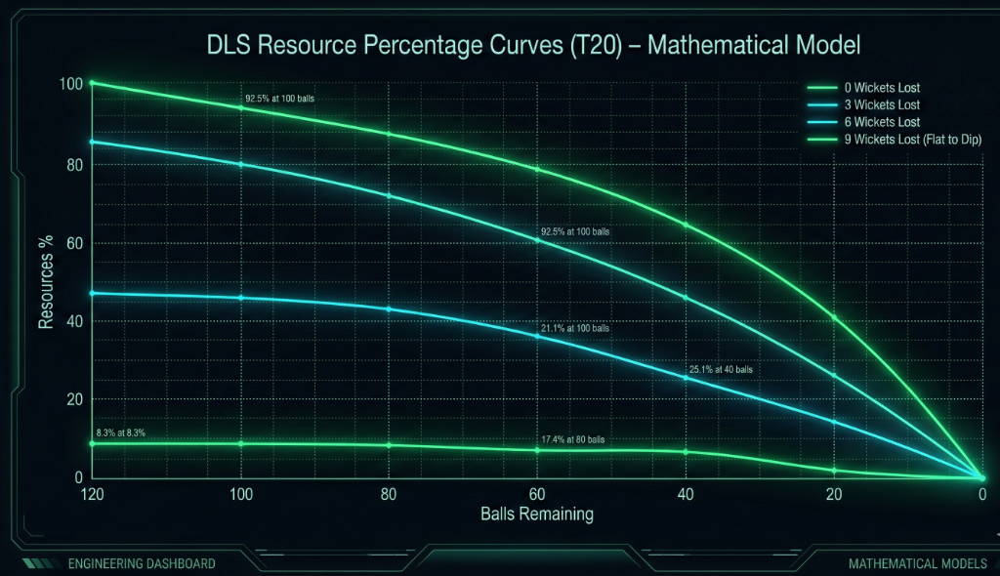

# 🏏 Duckworth–Lewis–Stern (DLS) Calculator

A precision-engineered cricket analytics tool for real-time revised target calculations during weather-interrupted matches.

## 💡 Motivation & Problem Statement

<p align="center">
  
</p>

### 🌧️ The Rain That Changed the Course of an IPL Final

The 2023 IPL Final between **Chennai Super Kings** and **Gujarat Titans** was shaping up to be a high-scoring classic. Gujarat Titans posted a massive 214 runs, putting CSK under huge pressure in the biggest match of the season.

But just as CSK were about to begin their chase, heavy rain hit the stadium. Play was completely washed out for the night. For the first time in IPL final history, the championship had to be pushed to the reserve day, with weather still threatening to interfere again.

When the match finally resumed, cricket faced a familiar challenge: **How do you fairly revise a target when overs are lost?**

That’s when the **Duckworth–Lewis–Stern (DLS)** method came into action. Instead of chasing 214 in 20 overs, CSK were given a revised target of 171 in 15 overs — a completely different game requiring explosive batting, smart risk-taking, and precise calculations. What followed was one of the most dramatic chases in cricket history, decided on the very last ball.

### 🚀 Why This Moment Inspired This App

The 2023 IPL Final showed millions of fans that:

- **Rain can rewrite a match in seconds**
- **Targets aren’t guesses — they’re driven by data**
- **DLS can decide championships**

Yet most viewers struggled to instantly understand: _"What’s the new target? Why this number?"_

This frustration identified a clear gap for a tool that combined mathematical accuracy with a premium, intuitive user experience. This app exists to make those moments clear — instantly, accurately, and simply.

---

## 🎯 The Approach: Building for Trust & Clarity

> **Engineering at a Glance:** A decoupled **Django (DRF)** backend powering a high-performance **React** frontend, unified across platforms via **Capacitor**.

To solve the accessibility and transparency issues of existing tools, this project was developed with three core pillars in mind:

- **Mathematical Integrity**: Moving away from "approximate" calculations. By using high-precision numerical libraries (NumPy) and standard DLS resource tables, we ensure every run and ball is accounted for with professional-grade accuracy.
- **Intuitive Feedback Loops**: DLS can often feel like a "black box." Our interface is designed to provide immediate visual feedback, showing users exactly how inputs like "Wickets Lost" or "Overs Curtailed" shift the resource percentage in real-time, backed by specific resource tables for each match format.
- **Mobile-First Resilience**: Recognizing that cricket fans are often on the move or at the stadium, the architecture prioritizes a lightweight, stateless API and a responsive mobile-first UI for reliable performance even on unstable networks.

---

## 📸 The Solution in Action

<p align="center">
  
</p>
<p align="center"><i>The main dashboard providing intuitive navigation for complex rain-interruption scenarios.</i></p>

---

## Project Resources & Reference Links

### 🔗 Accessible Links

- **Live Web Application**: [dls.nishanthm.com](https://dls.nishanthm.com/)
- **Production API**: [API Root & Documentation](https://api.dls.nishanthm.com/)
- **Mobile Application**: _(Placeholder)_

### 📚 Research & References

- **Wikipedia**: [Duckworth–Lewis–Stern Method](https://en.wikipedia.org/wiki/Duckworth%E2%80%93Lewis%E2%80%93Stern_method)
- **ESPNCricinfo**: [Understanding the DLS Method - How it works](https://www.espncricinfo.com/column/understanding-the-dls-method-1110594)
- **ICC Official**: [Cricket Playing Conditions & Regulations](https://www.icc-cricket.com/about/rules-and-regulations/playing-conditions)

---

## ⚡ Engineered Capabilities

- **📏 Standard DLS Scenarios**: Comprehensive support for all standard rain-interruption models, including delayed starts, mid-innings breaks, and curtailed play.
- **⚙️ Precision Calculation Engine**: High-fidelity resource table lookups using numpy-based interpolation for ball-by-ball accuracy.
- **☁️ Stateless REST Architecture**: A decoupled backend provides a reliable calculation service, ensuring consistency across all client platforms.
- **📱 Cross-Platform Readiness**: A single codebase powering a responsive web application and a Capacitor-enabled Android app.
- **🎨 Minimalist UX**: Designed to deliver complex mathematical results with zero friction, optimized for high-pressure match situations.

### Supported Match Formats

The calculator supports all standard limited-overs cricket formats, leveraging specialized resource data for each:

- **ODI (50 Overs)**: Full 300-ball resource table mapping.
- **T20 (20 Overs)**: Optimized 120-ball resource table for modern short-format dynamics.
- **T10 (10 Overs)**: Specialized resource mapping for ultra-short format calculations.

---

## 🛠️ Architecture & Tech Stack

The application is built with a focus on scalability, maintainability, and a clear separation of concerns.

- **🐍 Backend**: Python and Django REST Framework (DRF) were selected for the calculation engine. Python’s robust numerical libraries (NumPy, Pandas) handle the resource table interpolations with the required precision, while DRF provides a clean, documented API layer.
- **⚛️ Frontend**: React and Vite provide a high-performance, reactive interface. TypeScript is used throughout to ensure type safety, particularly when handling complex match state data.
- **🚢 Mobile Layer**: Capacitor enables the web-first codebase to be deployed as a native Android application, ensuring consistent behavior across web and mobile environments.
- **🚀 Deployment**: The architecture is designed for [serverless](vercel.json) environments (e.g., Vercel), leveraging edge-ready configurations for low latency and high availability.

## 🏗️ System Design Overview

<p align="center">
  
</p>

The system follows an API-first design philosophy, where the core logic is entirely decoupled from the presentation layer. Each calculation request is handled statelessly, meaning the backend does not retain any match state between calls. This idempotency is critical for horizontal scaling and seamless integration with serverless platforms like Vercel.

---

## 🔍 Technical Deep Dives

### DLS Calculation Engine

<p align="center">
  
</p>
<p align="center"><i>Visual representation of the mathematical model: Resource decay curves for T20 match formats at various wicket states.</i></p>

The engine is modeled around standard DLS resource tables, stored internally for high-speed retrieval. Since DLS resources vary ball-by-ball, the engine uses linear interpolation to determine the exact resource percentage for any given state (overs used, wickets lost).

- **Precision Handling**: Calculations are performed using NumPy to avoid the inaccuracies inherent in standard floating-point arithmetic.
- **Rounding Strategy**: A consistent rounding strategy is applied only at the final target calculation stage to maintain mathematical integrity throughout the intermediate steps.
- **Language Choice**: Python and NumPy were chosen specifically for their dominance in numerical computing and the reliability of their interpolation libraries.

### API Design & Contracts

The API is built with a focus on determinism and robustness.

- **RESTful Structure**: Endpoints are categorized by match scenario, providing clear entry points for callers.
- **Input Validation**: Strict schema validation ensures that illogical match states (e.g., more wickets lost than available) are caught early with graceful error responses.
- **Determinism**: Given the same inputs, the API is guaranteed to return the same calculation, facilitating easier testing and client-side caching.

#### Core Endpoints

| Endpoint                    | Method | Description                                            |
| :-------------------------- | :----- | :----------------------------------------------------- |
| `/api/calculate-dls-score/` | `POST` | Primary calculation engine for all DLS scenarios.      |
| `/api/resource-table/`      | `GET`  | Retrieves raw resource data for various match formats. |
| `/api/health-check/`        | `GET`  | System availability and latency monitoring.            |
| `/api/privacy-policy/`      | `GET`  | Serves standardized privacy and usage guidelines.      |

**Sample Calculation Request:**

```json
{
  "scenario_type": "INTERRUPTED_FIRST_INNINGS",
  "match_format": "T20",
  "inputs": {
    "overs_available_at_start": 20,
    "runs_scored": 150,
    "wickets_lost": 4,
    "overs_used": 15.2
  }
}
```

### Frontend Engineering Considerations

The frontend architecture emphasizes a clean separation between UI components and domain logic.

- **Type-Safe Domain**: TypeScript interfaces define the match state, preventing common bugs related to inconsistent data structures.
- **Service Layer**: All API interactions are encapsulated within a dedicated service layer, making the components unaware of the underlying transport mechanism.
- **Vite Bundling**: Chosen for its superior development speed and efficient production builds compared to traditional bundlers.
- **Edge State Handling**: The UI is designed to handle API downtime and malformed inputs gracefully, providing clear feedback to the user.

---

## 🛡️ Reliability & Performance

- **Cold-Start Optimization**: The backend is lightweight, ensuring minimal latency even in serverless "cold start" scenarios.
- **Deterministic Execution**: DLS calculations are compute-light but require high precision; the engine is optimized to deliver results in sub-millisecond timeframes.
- **Payload Efficiency**: API responses are minimized to reduce data consumption for mobile users on unstable networks.
- **Privacy by Design**: The application does not persist match data or track user behavior.
- **Stateless Security**: By avoiding session management and persistence, the attack surface is significantly reduced.
- **No-Auth Architecture**: As a public utility tool, the API is designed to be accessible without the overhead of authentication.

### Limitations & Assumptions

- **Standard DLS Model**: The calculations follow the standard professional DLS resource tables. Slight variances may occur if compared against proprietary ICC "DLS 5.0" software.
- **Minimum Over Completion**: For a result to be valid, minimum over requirements (usually 20 for ODI, 5 for T20) must be met per standard cricket laws.
- **Resource Constant (G50)**: The engine uses average G50 values (e.g., 245 for ODIs, 160 for T20s) as placeholders unless specific match-type constants are provided.

---

## 💻 Developer Guide

### Project Structure

- `backend/`: Contains the Django REST API, core DLS calculation logic, and resource table management.
- `frontend/`: Contains the React-based UI, TypeScript service layer for API communication, and Capacitor mobile configuration.
- `configs/`: Deployment-specific configurations and environment templates.

### Setup & Installation

#### Prerequisites

- Python 3.11+
- Node.js 20+
- npm or yarn

#### Quick Start

1. **Backend**:
   ```bash
   cd backend && pip install -r requirements.txt && python manage.py runserver
   ```
2. **Frontend**:
   ```bash
   cd frontend && npm install && npm run dev
   ```

### Usage Guide

1. **Select Match Scenario**: Choose from the available DLS scenarios (e.g., Curtailed First Innings, Interrupted Second Innings).
2. **Input Match Data**: Enter the required parameters such as overs played, runs scored, and wickets lost at the point of interruption.
3. **Calculate Revised Target**: The system will communicate with the Django REST API to process the inputs and return the precise DLS target or par score.
4. **Mobile Deployment**: For Android, use Capacitor commands to build and sync the project for mobile testing:
   ```bash
   npx cap sync android
   ```

## 🌐 Community & Vision

### Target Users

- **Cricket Fans**: Those seeking clarity on revised targets during high-stakes intervals.
- **Mobile Developers**: Engineers looking for a production-grade reference on bridging complex React/TypeScript logic to a high-performance **Android** environment via **Capacitor**.

### Developer Experience

- **Clarity over Cleverness**: The codebase prioritizes readability, ensuring that the DLS logic—often considered a "black box"—is transparent and auditable.
- **Modular Structure**: The clear separation between `backend/` and `frontend/` allows developers to work on either layer independently.
- **Standard Tooling**: Leveraging standard Django and React patterns ensures a low barrier to entry for new contributors.

### Contribution Guidelines

1. **Feature Requests**: Open an issue to discuss proposed enhancements.
2. **Bug Reports**: Provide detailed replication steps and match scenario parameters.
3. **Pull Requests**: ensure all new DLS logic is accompanied by unit tests covering edge-case scenarios.

---

## 🤝 Author & Intent

This project is a culmination of a passion for cricket and a commitment to real-world problem solving. It reflects an architectural approach to product engineering: identifying a technical shortcoming in a beloved sport and building a production-grade solution that prioritizes both precision and the user.

## 📄 License

This project is licensed under the **MIT License**. See the `LICENSE` file for details.
