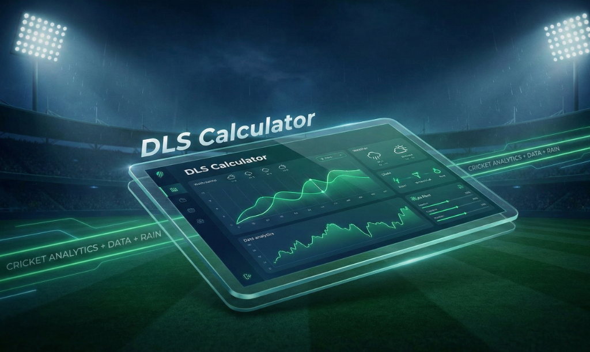

# Duckworth–Lewis–Stern (DLS) Calculator

<p align="center">
  
</p>

A precision-engineered cricket analytics tool for real-time revised target calculations during weather-interrupted matches.

## Motivation & Problem Statement

### Origin Story

The motivation for this project was born during the 2023 IPL Final between CSK and GT. As the match extended into a reserve day due to persistent rain, I found myself traveling and wanting to understand the potential revised targets mid-innings.

The existing DLS calculators available online were consistently disappointing: many were difficult to locate, featured convoluted user interfaces, or lacked clarity in how inputs directly influenced the par score. This frustration identified a clear gap for a tool that combined mathematical accuracy with a premium, intuitive user experience. What began as a personal utility for a single match has evolved into a robust solution for cricket fans and analysts globally.

## Key Features

- **Standard DLS Scenarios**: Comprehensive support for all standard rain-interruption models, including delayed starts, mid-innings breaks, and curtailed play.
- **Precision Calculation Engine**: High-fidelity resource table lookups using numpy-based interpolation for ball-by-ball accuracy.
- **Stateless REST Architecture**: A decoupled backend provides a reliable calculation service, ensuring consistency across all client platforms.
- **Cross-Platform Readiness**: A single codebase powering a responsive web application and a Capacitor-enabled Android app.
- **Minimalist UX**: Designed to deliver complex mathematical results with zero friction, optimized for high-pressure match situations.

## Screenshots / Demo

> [!NOTE]
> _Visual demonstrations and application screenshots are being prepared for the upcoming public release._

## Architecture & Tech Stack

The application is built with a focus on scalability, maintainability, and a clear separation of concerns.

- **Backend**: Python and Django REST Framework (DRF) were selected for the calculation engine. Python’s robust numerical libraries (NumPy, Pandas) handle the resource table interpolations with the required precision, while DRF provides a clean, documented API layer.
- **Frontend**: React and Vite provide a high-performance, reactive interface. TypeScript is used throughout to ensure type safety, particularly when handling complex match state data.
- **Mobile Layer**: Capacitor enables the web-first codebase to be deployed as a native Android application, ensuring consistent behavior across web and mobile environments.
- [Deployment](file:///home/opc/projects/inprogress/duckworth-lewis-score-calculator/vercel.json): The architecture is designed for serverless environments (e.g., Vercel), leveraging edge-ready configurations for low latency and high availability.

## System Design Overview

The system follows an API-first design philosophy, where the core logic is entirely decoupled from the presentation layer. Each calculation request is handled statelessly, meaning the backend does not retain any match state between calls. This idempotency is critical for horizontal scaling and seamless integration with serverless platforms like Vercel.

**Request Flow**:
`React UI (State Management) → TypeScript Service Layer → Django REST API → DLS Calculation Engine (NumPy) → JSON Response`

## DLS Calculation Engine

The engine is modeled around standard DLS resource tables, stored internally for high-speed retrieval. Since DLS resources vary ball-by-ball, the engine uses linear interpolation to determine the exact resource percentage for any given state (overs used, wickets lost).

- **Precision Handling**: Calculations are performed using NumPy to avoid the inaccuracies inherent in standard floating-point arithmetic.
- **Rounding Strategy**: A consistent rounding strategy is applied only at the final target calculation stage to maintain mathematical integrity throughout the intermediate steps.
- **Language Choice**: Python and NumPy were chosen specifically for their dominance in numerical computing and the reliability of their interpolation libraries.

## API Design & Contracts

The API is built with a focus on determinism and robustness.

- **RESTful Structure**: Endpoints are categorized by match scenario, providing clear entry points for callers.
- **Input Validation**: Strict schema validation ensures that illogical match states (e.g., more wickets lost than available) are caught early with graceful error responses.
- **Determinism**: Given the same inputs, the API is guaranteed to return the same calculation, facilitating easier testing and client-side caching.

## Project Structure

- `backend/`: Contains the Django REST API, core DLS calculation logic, and resource table management.
- `frontend/`: Contains the React-based UI, TypeScript service layer for API communication, and Capacitor mobile configuration.
- `configs/`: Deployment-specific configurations and environment templates.

## Setup & Installation Instructions

### Prerequisites

- Python 3.10+
- Node.js 18+
- npm or yarn

### Backend Setup (Django)

1. Navigate to the backend directory:
   ```bash
   cd backend
   ```
2. Create and activate a virtual environment:
   ```bash
   python -m venv venv
   source venv/bin/activate  # On Windows: venv\Scripts\activate
   ```
3. Install dependencies:
   ```bash
   pip install -r requirements.txt
   ```
4. Run migrations:
   ```bash
   python manage.py migrate
   ```
5. Start the development server:
   ```bash
   python manage.py runserver
   ```

### Frontend Setup (React/Vite)

1. Navigate to the frontend directory:
   ```bash
   cd frontend
   ```
2. Install dependencies:
   ```bash
   npm install
   ```
3. Start the Vite development server:
   ```bash
   npm run dev
   ```

## Usage Guide

1. **Select Match Scenario**: Choose from the available DLS scenarios (e.g., Curtailed First Innings, Interrupted Second Innings).
2. **Input Match Data**: Enter the required parameters such as overs played, runs scored, and wickets lost at the point of interruption.
3. **Calculate Revised Target**: The system will communicate with the Django REST API to process the inputs and return the precise DLS target or par score.
4. **Mobile Deployment**: For Android, use Capacitor commands (`npx cap sync android`) to build and sync the project for mobile testing.

## Supported Match Formats

The calculator supports all standard limited-overs cricket formats, leveraging specialized resource data for each:

- **ODI (50 Overs)**: Full 300-ball resource table mapping.
- **T20 (20 Overs)**: Optimized 120-ball resource table for modern short-format dynamics.
- **T10 (10 Overs)**: Specialized resource mapping for ultra-short format calculations.

## Limitations & Assumptions

- **Standard DLS Model**: The calculations follow the standard/professional DLS resource tables. Slight variances may occur if compared against proprietary ICC "DLS 5.0" software, which remains closed-source.
- **Minimum Over Completion**: For a result to be valid, minimum over requirements (usually 20 for ODI, 5 for T20) must be met per standard cricket laws.
- **Resource Constant (G50)**: The engine uses average G50 values (e.g., 245 for ODIs, 160 for T20s) as placeholders unless specific match-type constants are provided.

## Frontend Engineering Considerations

The frontend architecture emphasizes a clean separation between UI components and domain logic.

- **Type-Safe Domain**: TypeScript interfaces define the match state, preventing common bugs related to inconsistent data structures.
- **Service Layer**: All API interactions are encapsulated within a dedicated service layer, making the components unaware of the underlying transport mechanism.
- **Vite Bundling**: Chosen for its superior development speed and efficient production builds compared to traditional bundlers.
- **Edge State Handling**: The UI is designed to handle API downtime and malformed inputs gracefully, providing clear feedback to the user.

## Platform Support

- **Web**: Fully responsive web application optimized for desktop and mobile browsers.
- **Android**: Native mobile experience powered by Capacitor.
- **PWA**: Architecturally ready for Progressive Web App deployment to support offline-first capabilities.

## Target Users

- **Cricket Fans**: Those seeking clarity on revised targets during high-stakes intervals.
- **Local Leagues**: Match officials and organizers requiring an accessible, reliable DLS tool.
- **Analysts**: Professional and amateur analysts looking for a stateless calculation service.

## Design Philosophy

- **Accuracy over Abstraction**: The underlying DLS mathematics are never compromised for simplicity.
- **UX-First Mentality**: Complex inputs are broken down into logical flows, reducing user error during hurried match phases.
- **Credibility and Trust**: A mature, professional design language that reflects the precision of the calculations.

## Future Enhancements

- **Extended Match Formats**: Support for diverse regional and local tournament variations.
- **Offline Mode**: Full offline calculation support via service workers and local caching.
- **Historical Analysis**: Ability to simulate historical DLS scenarios for comparative analysis.

## Performance & Reliability

- **Cold-Start Optimization**: The backend is lightweight, ensuring minimal latency even in serverless "cold start" scenarios.
- **Deterministic Execution**: DLS calculations are compute-light but require high precision; the engine is optimized to deliver results in sub-millisecond timeframes.
- **Payload Efficiency**: API responses are minimized to reduce data consumption for mobile users on unstable networks.

## Security & Data Handling

- **Privacy by Design**: The application does not persist match data or track user behavior.
- **Stateless Security**: By avoiding session management and persistence, the attack surface is significantly reduced.
- **No-Auth Architecture**: As a public utility tool, the API is designed to be accessible without the overhead of authentication, simplifying the client-side implementation.

## Developer Experience

- **Clarity over Cleverness**: The codebase prioritizes readability, ensuring that the DLS logic—often considered a "black box"—is transparent and auditable.
- **Modular Structure**: The clear separation between `backend/` and `frontend/` allows developers to work on either layer independently.
- **Standard Tooling**: Leveraging standard Django and React patterns ensures a low barrier to entry for new contributors.

## Contribution Guidelines

We welcome contributions from developers and cricket analysts.

1. **Feature Requests**: Open an issue to discuss proposed enhancements.
2. **Bug Reports**: Provide detailed replication steps and match scenario parameters.
3. **Pull Requests**: ensure all new DLS logic is accompanied by unit tests covering edge-case scenarios.

## License

This project is licensed under the **MIT License**. See the `LICENSE` file for details.

## Author & Intent

This project is a culmination of a passion for cricket and a commitment to real-world problem solving. It reflects an architectural approach to product engineering: identifying a technical shortcoming in a beloved sport and building a production-grade solution that prioritizes both precision and the user.
